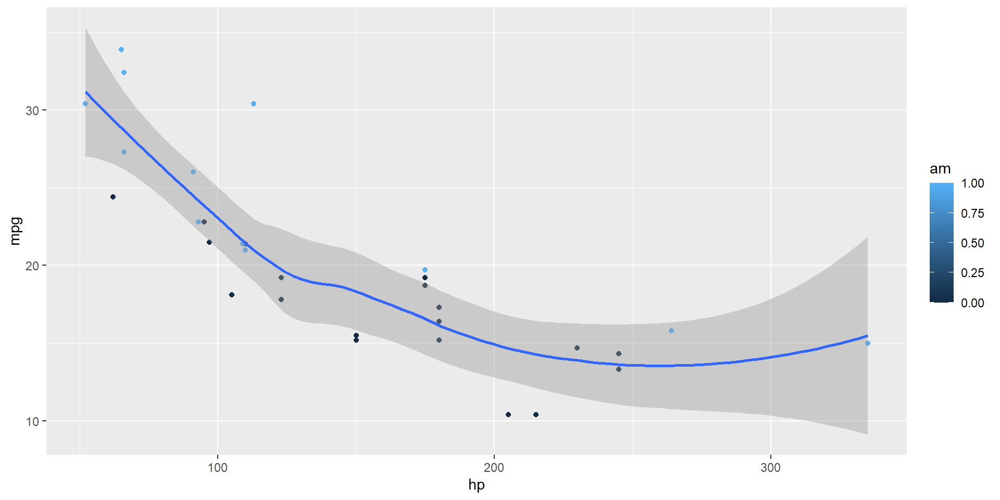

## Hello, There

This presentation will show you examples of what you can do with Quarto and [Reveal.js](https://revealjs.com), including:

-   Presenting code and LaTeX equations
-   Including computations in slide output
-   Image, video, and iframe backgrounds
-   Fancy transitions and animations
-   Activating scroll view

...and much more

## Pretty Code {auto-animate="true"}

-   Over 20 syntax highlighting themes available
-   Default theme optimized for accessibility

``` r
# Define a server for the Shiny app
function(input, output) {
  
  # Fill in the spot we created for a plot
  output$phonePlot <- renderPlot({
    # Render a barplot
  })
}
```

::: footer
Learn more: [Syntax Highlighting](https://quarto.org/docs/output-formats/html-code.html#highlighting)
:::

## Code Animations {auto-animate="true"}

-   Over 20 syntax highlighting themes available
-   Default theme optimized for accessibility

``` r
# Ausführbarer Code
function(input, output) {
  
  # Fill in the spot we created for a plot
  output$phonePlot <- renderPlot({
    # Render a barplot
    barplot(WorldPhones[,input$region]*1000, 
            main=input$region,
            ylab="Number of Telephones",
            xlab="Year")
  })
}
```

::: footer
Learn more: [Code Animations](https://quarto.org/docs/presentations/revealjs/advanced.html#code-animations)
:::

## Line Highlighting

-   Highlight specific lines for emphasis
-   Incrementally highlight additional lines

``` {.python code-line-numbers="4-5|7|10"}
import numpy as np
import matplotlib.pyplot as plt

r = np.arange(0, 2, 0.01)
theta = 2 * np.pi * r
fig, ax = plt.subplots(subplot_kw={'projection': 'polar'})
ax.plot(theta, r)
ax.set_rticks([0.5, 1, 1.5, 2])
ax.grid(True)
plt.show()
```

::: footer
Learn more: [Line Highlighting](https://quarto.org/docs/presentations/revealjs/#line-highlighting)
:::

## Executable Code


::: {.cell}

```{.r .cell-code}
library(ggplot2)
ggplot(mtcars, aes(hp, mpg, color = am)) +
  geom_point() +
  geom_smooth(formula = y ~ x, method = "loess")
```

::: {.cell-output-display}
{width=960}
:::
:::


::: footer
Learn more: [Executable Code](https://quarto.org/docs/presentations/revealjs/#executable-code)
:::

## LaTeX Equations

[MathJax](https://www.mathjax.org/) rendering of equations to HTML

::::: columns
::: {.column width="40%"}
``` tex
\begin{gather*}
a_1=b_1+c_1\\
a_2=b_2+c_2-d_2+e_2
\end{gather*}

\begin{align}
a_{11}& =b_{11}&
  a_{12}& =b_{12}\\
a_{21}& =b_{21}&
  a_{22}& =b_{22}+c_{22}
\end{align}
```
:::

::: {.column width="60%"}
\begin{gather*}
a_1=b_1+c_1\\
a_2=b_2+c_2-d_2+e_2
\end{gather*}
\begin{align}
a_{11}& =b_{11}&
  a_{12}& =b_{12}\\
a_{21}& =b_{21}&
  a_{22}& =b_{22}+c_{22}
\end{align}
:::
:::::

::: footer
Learn more: [LaTeX Equations](https://quarto.org/docs/authoring/markdown-basics.html#equations)
:::

## Column Layout {.smaller}

Arrange content into columns of varying widths:

:::::: columns
::: {.column width="35%"}
#### Motor Trend Car Road Tests

The data was extracted from the 1974 Motor Trend US magazine, and comprises fuel consumption and 10 aspects of automobile design and performance for 32 automobiles.
:::

::: {.column width="3%"}
:::

::: {.column width="62%"}


::: {.cell}
::: {.cell-output-display}


|                  |  mpg| cyl| disp|  hp|    wt|
|:-----------------|----:|---:|----:|---:|-----:|
|Mazda RX4         | 21.0|   6|  160| 110| 2.620|
|Mazda RX4 Wag     | 21.0|   6|  160| 110| 2.875|
|Datsun 710        | 22.8|   4|  108|  93| 2.320|
|Hornet 4 Drive    | 21.4|   6|  258| 110| 3.215|
|Hornet Sportabout | 18.7|   8|  360| 175| 3.440|
|Valiant           | 18.1|   6|  225| 105| 3.460|


:::
:::


:::
::::::

::: footer
Learn more: [Multiple Columns](https://quarto.org/docs/presentations/revealjs/#multiple-columns)
:::

## Incremental Lists

Lists can optionally be displayed incrementally:

::: incremental
-   First item
-   Second item
-   Third item
:::

. . .

<br/> Insert pauses to make other types of content display incrementally.

::: footer
Learn more: [Incremental Lists](https://quarto.org/docs/presentations/revealjs/#incremental-lists)
:::

## Fragments

Incremental text display and animation with fragments:

<br/>

::: {.fragment .fade-in}
Fade in
:::

::: {.fragment .fade-up}
Slide up while fading in
:::

::: {.fragment .fade-left}
Slide left while fading in
:::

::: {.fragment .fade-in-then-semi-out}
Fade in then semi out
:::

. . .

::: {.fragment .strike}
Strike
:::

::: {.fragment .highlight-red}
Highlight red
:::

::: footer
Learn more: [Fragments](https://quarto.org/docs/presentations/revealjs/advanced.html#fragments)
:::

## Slide Backgrounds {background="#43464B"}

Set the `background` attribute on a slide to change the background color (all CSS color formats are supported).

Different background transitions are available via the `background-transition` option.

::: footer
Learn more: [Slide Backgrounds](https://quarto.org/docs/presentations/revealjs/#color-backgrounds)
:::

## Media Backgrounds {background="#43464B" background-image="images/milky-way.jpeg"}

You can also use the following as a slide background:

-   An image: `background-image`

-   A video: `background-video`

-   An iframe: `background-iframe`

::: footer
Learn more: [Media Backgrounds](https://quarto.org/docs/presentations/revealjs/#image-backgrounds)
:::

## Absolute Position

Position images or other elements at precise locations

{.absolute top="170" left="30" width="400" height="400"}

{.absolute .fragment top="150" right="80" width="450"}

{.absolute .fragment bottom="110" right="130" width="300"}

::: footer
Learn more: [Absolute Position](https://quarto.org/docs/presentations/revealjs/advanced.html#absolute-position)
:::

## Auto-Animate {auto-animate="true" auto-animate-easing="ease-in-out"}

Automatically animate matching elements across slides with Auto-Animate.

:::::: r-hstack
::: {data-id="box1" auto-animate-delay="0" style="background: #2780e3; width: 200px; height: 150px; margin: 10px;"}
:::

::: {data-id="box2" auto-animate-delay="0.1" style="background: #3fb618; width: 200px; height: 150px; margin: 10px;"}
:::

::: {data-id="box3" auto-animate-delay="0.2" style="background: #e83e8c; width: 200px; height: 150px; margin: 10px;"}
:::
::::::

::: footer
Learn more: [Auto-Animate](https://quarto.org/docs/presentations/revealjs/advanced.html#auto-animate)
:::

## Auto-Animate {auto-animate="true" auto-animate-easing="ease-in-out"}

Automatically animate matching elements across slides with Auto-Animate.

:::::: r-stack
::: {data-id="box1" style="background: #2780e3; width: 350px; height: 350px; border-radius: 200px;"}
:::

::: {data-id="box2" style="background: #3fb618; width: 250px; height: 250px; border-radius: 200px;"}
:::

::: {data-id="box3" style="background: #e83e8c; width: 150px; height: 150px; border-radius: 200px;"}
:::
::::::

::: footer
Learn more: [Auto-Animate](https://quarto.org/docs/presentations/revealjs/advanced.html#auto-animate)
:::

## Slide Transitions {.smaller}

The next few slides will transition using the `slide` transition

| Transition | Description |
|---------------|---------------------------------------------------------|
| `none` | No transition (default, switch instantly) |
| `fade` | Cross fade |
| `slide` | Slide horizontally |
| `convex` | Slide at a convex angle |
| `concave` | Slide at a concave angle |
| `zoom` | Scale the incoming slide so it grows in from the center of the screen. |

::: footer
Learn more: [Slide Transitions](https://quarto.org/docs/presentations/revealjs/advanced.html#slide-transitions)
:::

## Tabsets {.smaller .scrollable transition="slide"}

::: panel-tabset
### Plot


::: {.cell}
::: {.cell-output-display}
{width=960}
:::
:::


### Data


::: {.cell}
::: {.cell-output-display}


|                    |  mpg| cyl|  disp|  hp| drat|    wt|  qsec| vs| am| gear| carb|
|:-------------------|----:|---:|-----:|---:|----:|-----:|-----:|--:|--:|----:|----:|
|Mazda RX4           | 21.0|   6| 160.0| 110| 3.90| 2.620| 16.46|  0|  1|    4|    4|
|Mazda RX4 Wag       | 21.0|   6| 160.0| 110| 3.90| 2.875| 17.02|  0|  1|    4|    4|
|Datsun 710          | 22.8|   4| 108.0|  93| 3.85| 2.320| 18.61|  1|  1|    4|    1|
|Hornet 4 Drive      | 21.4|   6| 258.0| 110| 3.08| 3.215| 19.44|  1|  0|    3|    1|
|Hornet Sportabout   | 18.7|   8| 360.0| 175| 3.15| 3.440| 17.02|  0|  0|    3|    2|
|Valiant             | 18.1|   6| 225.0| 105| 2.76| 3.460| 20.22|  1|  0|    3|    1|
|Duster 360          | 14.3|   8| 360.0| 245| 3.21| 3.570| 15.84|  0|  0|    3|    4|
|Merc 240D           | 24.4|   4| 146.7|  62| 3.69| 3.190| 20.00|  1|  0|    4|    2|
|Merc 230            | 22.8|   4| 140.8|  95| 3.92| 3.150| 22.90|  1|  0|    4|    2|
|Merc 280            | 19.2|   6| 167.6| 123| 3.92| 3.440| 18.30|  1|  0|    4|    4|
|Merc 280C           | 17.8|   6| 167.6| 123| 3.92| 3.440| 18.90|  1|  0|    4|    4|
|Merc 450SE          | 16.4|   8| 275.8| 180| 3.07| 4.070| 17.40|  0|  0|    3|    3|
|Merc 450SL          | 17.3|   8| 275.8| 180| 3.07| 3.730| 17.60|  0|  0|    3|    3|
|Merc 450SLC         | 15.2|   8| 275.8| 180| 3.07| 3.780| 18.00|  0|  0|    3|    3|
|Cadillac Fleetwood  | 10.4|   8| 472.0| 205| 2.93| 5.250| 17.98|  0|  0|    3|    4|
|Lincoln Continental | 10.4|   8| 460.0| 215| 3.00| 5.424| 17.82|  0|  0|    3|    4|
|Chrysler Imperial   | 14.7|   8| 440.0| 230| 3.23| 5.345| 17.42|  0|  0|    3|    4|
|Fiat 128            | 32.4|   4|  78.7|  66| 4.08| 2.200| 19.47|  1|  1|    4|    1|
|Honda Civic         | 30.4|   4|  75.7|  52| 4.93| 1.615| 18.52|  1|  1|    4|    2|
|Toyota Corolla      | 33.9|   4|  71.1|  65| 4.22| 1.835| 19.90|  1|  1|    4|    1|
|Toyota Corona       | 21.5|   4| 120.1|  97| 3.70| 2.465| 20.01|  1|  0|    3|    1|
|Dodge Challenger    | 15.5|   8| 318.0| 150| 2.76| 3.520| 16.87|  0|  0|    3|    2|
|AMC Javelin         | 15.2|   8| 304.0| 150| 3.15| 3.435| 17.30|  0|  0|    3|    2|
|Camaro Z28          | 13.3|   8| 350.0| 245| 3.73| 3.840| 15.41|  0|  0|    3|    4|
|Pontiac Firebird    | 19.2|   8| 400.0| 175| 3.08| 3.845| 17.05|  0|  0|    3|    2|
|Fiat X1-9           | 27.3|   4|  79.0|  66| 4.08| 1.935| 18.90|  1|  1|    4|    1|
|Porsche 914-2       | 26.0|   4| 120.3|  91| 4.43| 2.140| 16.70|  0|  1|    5|    2|
|Lotus Europa        | 30.4|   4|  95.1| 113| 3.77| 1.513| 16.90|  1|  1|    5|    2|
|Ford Pantera L      | 15.8|   8| 351.0| 264| 4.22| 3.170| 14.50|  0|  1|    5|    4|
|Ferrari Dino        | 19.7|   6| 145.0| 175| 3.62| 2.770| 15.50|  0|  1|    5|    6|
|Maserati Bora       | 15.0|   8| 301.0| 335| 3.54| 3.570| 14.60|  0|  1|    5|    8|
|Volvo 142E          | 21.4|   4| 121.0| 109| 4.11| 2.780| 18.60|  1|  1|    4|    2|


:::
:::


:::

::: footer
Learn more: [Tabsets](https://quarto.org/docs/presentations/revealjs/#tabsets)
:::

## Interactive Slides {.smaller transition="slide"}

Include Jupyter widgets and htmlwidgets in your presentations


::: {.cell}
::: {.cell-output-display}

```{=html}
<div class="leaflet html-widget html-fill-item" id="htmlwidget-2fc2ea685f58842757ea" style="width:960px;height:480px;"></div>
<script type="application/json" data-for="htmlwidget-2fc2ea685f58842757ea">{"x":{"options":{"crs":{"crsClass":"L.CRS.EPSG3857","code":null,"proj4def":null,"projectedBounds":null,"options":{}}},"calls":[{"method":"addTiles","args":["https://{s}.tile.openstreetmap.org/{z}/{x}/{y}.png",null,null,{"minZoom":0,"maxZoom":18,"tileSize":256,"subdomains":"abc","errorTileUrl":"","tms":false,"noWrap":false,"zoomOffset":0,"zoomReverse":false,"opacity":1,"zIndex":1,"detectRetina":false,"attribution":"&copy; <a href=\"https://openstreetmap.org/copyright/\">OpenStreetMap<\/a>,  <a href=\"https://opendatacommons.org/licenses/odbl/\">ODbL<\/a>"}]},{"method":"addMarkers","args":[-36.852,174.768,null,null,null,{"interactive":true,"draggable":false,"keyboard":true,"title":"","alt":"","zIndexOffset":0,"opacity":1,"riseOnHover":false,"riseOffset":250},"The birthplace of R",null,null,null,null,{"interactive":false,"permanent":false,"direction":"auto","opacity":1,"offset":[0,0],"textsize":"10px","textOnly":false,"className":"","sticky":true},null]}],"limits":{"lat":[-36.852,-36.852],"lng":[174.768,174.768]}},"evals":[],"jsHooks":[]}</script>
```

:::
:::


::: footer
Learn more: [Jupyter widgets](https://quarto.org/docs/interactive/widgets/jupyter.html), [htmlwidgets](https://quarto.org/docs/interactive/widgets/htmlwidgets.html)
:::

## Interactive Slides {.smaller transition="slide"}

Turn presentations into applications with Observable and Shiny. Use component layout to position inputs and outputs.


::: {.cell}

:::

```{ojs}
//| panel: sidebar
viewof talentWeight = Inputs.range([-2, 2], { value: 0.7, step: 0.01, label: "talent weight" })
viewof looksWeight = Inputs.range([-2, 2], { value: 0.7, step: 0.01, label: "looks weight" })
viewof minimum = Inputs.range([-2, 2], { value: 1, step: 0.01, label: "min fame" })
```

```{ojs}
//| panel: fill
import { plotActors } from './actors.js';
plotActors(actors, talentWeight, looksWeight, minimum)
```


::: footer
Learn more: [Observable](https://quarto.org/docs/interactive/ojs/), [Shiny](https://quarto.org/docs/interactive/shiny/), [Component Layout](https://quarto.org/docs/interactive/layout.html)
:::

## Preview Links

Navigate to hyperlinks without disrupting the flow of your presentation.

Use the `preview-links` option to open links in an iframe on top of your slides. Try clicking the link below for a demonstration:

::: {style="text-align: center; margin-top: 1em"}
[Matplotlib: Visualization with Python](https://matplotlib.org/){preview-link="true" style="text-align: center"}
:::

::: footer
Learn more: [Preview Links](https://quarto.org/docs/presentations/revealjs/presenting.html#preview-links)
:::

## Themes

10 Built-in Themes (or [create your own](https://quarto.org/docs/presentations/revealjs/themes.html#creating-themes))

::: {layout-ncol="2"}


:::

::: footer
Learn more: [Themes](https://quarto.org/docs/presentations/revealjs/themes.html)
:::

## Easy Navigation

::: {style="margin-bottom: 0.9em;"}
Quickly jump to other parts of your presentation
:::

::: {layout="[1, 20]"}
{width="41"}

Toggle the slide menu with the menu button (bottom left of slide) to go to other slides and access presentation tools.
:::

You can also press  to toggle the menu open and closed.

You can also press  to toggle 'Jump To Slide' modal box to quickly go to one of your slide using its number or id.

::: footer
Learn more: [Navigation](/docs/presentations/revealjs/presenting.qmd#navigation-menu) / [Jump To Slide](/docs/presentations/revealjs/presenting.qmd#jump-to-slide)
:::

## Jump To Slide

::: {style="margin-bottom: 0.9em;"}
Quickly jump to other parts of your presentation
:::

## Chalkboard {chalkboard-buttons="true"}

::: {style="margin-bottom: 0.9em;"}
Free form drawing and slide annotations
:::

::: {layout="[1, 20]"}
{width="41"}

Use the chalkboard button at the bottom left of the slide to toggle the chalkboard.
:::

::: {layout="[1, 20]"}
{width="41"}

Use the notes canvas button at the bottom left of the slide to toggle drawing on top of the current slide.
:::

You can also press  to toggle the chalkboard or  to toggle the notes canvas.

::: footer
Learn more: [Chalkboard](https://quarto.org/docs/presentations/revealjs/presenting.html#chalkboard)
:::

## Point of View

press  to toggle overview mode:

{.border}

Hold down the  and click on any element to zoom towards it---try it now on this slide.

::: footer
Learn more: [Overview Mode](https://quarto.org/docs/presentations/revealjs/presenting.html#overview-mode), [Slide Zoom](https://quarto.org/docs/presentations/revealjs/presenting.html#slide-zoom)
:::

## Speaker View

press  (or use the tools in presentation menu {style="padding-bottom: 1px; margin: 0" width="0.5em" height="0.5em"}) to open speaker view

{fig-align="center" style="border: 3px solid #dee2e6;" width="780"}

::: footer
Learn more: [Speaker View](https://quarto.org/docs/presentations/revealjs/presenting.html#speaker-view)
:::

## Scroll View {#scroll-view}

Press  (or use the tools in presentation menu {style="padding-bottom: 1px; margin: 0" width="0.5em" height="0.5em"}) to open scroll view

Try it now on this slide --- You'll see a scroll bar on the right and you can scroll down the presentation using your mouse.

Scroll view behavior can be configured using `scroll-view` configuration.

::: footer
Learn more: [Scroll View](https://quarto.org/docs/presentations/revealjs/presenting.html#scroll-view)
:::

## Authoring Tools {.smaller}

Live side-by-side preview for any notebook or text editor including Jupyter and VS Code

::::: columns
::: {.column width="50%"}
{.border .border-thick}
:::

::: {.column width="50%"}
{.border .border-thick}
:::
:::::

::: footer
Learn more: [Jupyter](https://quarto.org/docs/tools/jupyter-lab.html), [VS Code](https://quarto.org/docs/tools/vscode.html), [Text Editors](https://quarto.org/docs/tools/text-editors.html)
:::

## Authoring Tools {.smaller}

RStudio includes an integrated presentation preview pane

{.border width="900"}

::: footer
Learn more: [RStudio](https://quarto.org/docs/tools/rstudio.html)
:::

## And More...

-   [Touch](https://quarto.org/docs/presentations/revealjs/advanced.html#touch-navigation) optimized (presentations look great on mobile, swipe to navigate slides)
-   [Footer & Logo](https://quarto.org/docs/presentations/revealjs/#footer-logo) (optionally specify custom footer per-slide or hide global footer)
-   [Auto-Slide](https://quarto.org/docs/presentations/revealjs/presenting.html#auto-slide) (step through slides automatically, without any user input)
-   [Multiplex](https://quarto.org/docs/presentations/revealjs/presenting.html#multiplex) (allows your audience to follow the slides of the presentation you are controlling on their own phone, tablet or laptop).

::: footer
Learn more: [Quarto Presentations](https://quarto.org/docs/presentations/revealjs/)
:::

